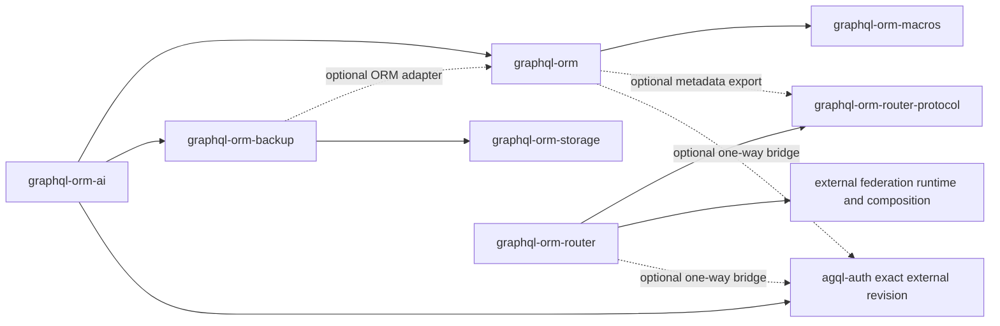

# GraphQL ORM system context

The repository contains seven independently consumable Rust packages. Workspace
membership provides coordinated development, path dependencies, and one lock
file; it does not combine the companion packages into features of the ORM.

The allowed internal dependency direction is acyclic:

`graphql-orm-ai -> graphql-orm-backup -> graphql-orm-storage`,
`graphql-orm-ai -> graphql-orm`, optional
`graphql-orm-backup -> graphql-orm`, and
`graphql-orm -> graphql-orm-macros`, plus
`graphql-orm-router -> graphql-orm-router-protocol` and optional
`graphql-orm -> graphql-orm-router-protocol`.

Internal packages use workspace path dependencies and the root `Cargo.lock`.
No package uses a Git dependency on another package in this repository.
`agql-auth` remains external and exact-revision pinned.

## Package responsibilities

| Package | Owns | Does not own |
| --- | --- | --- |
| `graphql-orm` | entity metadata, generated/runtime GraphQL operations, database execution, schema modules, persistence contracts | provider transport, backup repositories, application policy |
| `graphql-orm-macros` | proc-macro parsing and generated code | runtime I/O or application behavior |
| `graphql-orm-storage` | provider-neutral object/blob storage and streaming provider implementations | backup manifests, database records, application metadata |
| `graphql-orm-backup` | snapshot/restore orchestration, manifests, repository safety, optional ORM adapters | object transport implementations or application authorization |
| `graphql-orm-ai` | protected AI control plane, provider adapters, durable coordination, AI schema module | host authorization decisions, deployment credentials, arbitrary application mutation authority |
| `graphql-orm-router-protocol` | versioned project-neutral subgraph identity, endpoint advertisement, capabilities, fingerprints, operation and authorization declarations | URL trust, credentials, server runtime, database access, application policy |
| `graphql-orm-router` | federation composition/execution adapters, graph lifecycle, public transports, registration, authentication preflight, observability | authoritative subgraph authorization, ORM/database execution, application policy, identity issuance |

Reusable contracts are changed in their owning package and affected dependants
are updated in the same branch. The [workspace package inventory](../reference/workspace-packages.md)
is generated from Cargo metadata and records the current versions and direct
internal dependencies.

## Runtime trust boundaries

- Host applications own principal resolution, authorization, disclosure,
  routing, secret storage, deployment isolation, and product policy.
- ORM resolver metadata is discovery information, not execution authority.
- Router policy metadata may deny before downstream work but never grants
  authority; subgraph guards and database policy remain authoritative.
- Operation assurance augments ordinary authorization; it never replaces it.
- Storage providers own byte transport. Backup owns snapshot semantics. AI owns
  its module-specific restore validation and readiness gate.
- Uncertain external effects are not retried as though they were known absent.

The accepted decisions in [`docs/decisions`](../decisions/README.md) define
these boundaries precisely.
